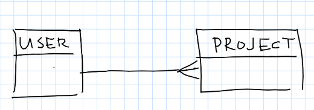

# Data Management and Analysis Project

## 1. Documentation

### Project Description

__TODO__: In this project, I am aiming to analyze and visualize data from Airbnb Listings from Singapore. I've heard it is quite expensive to live in Singapore, and I feel as if looking at the airbnb data may give me a glimpse into whether this is true and how widespread it is. 

### Data Source or Description of Data 

__TODO__: I found this dataset on Kaggle - https://www.kaggle.com/jojoker/singapore-airbnb/data#

There seems to be an id for each listing - this is most likely the primary key

There is a name for the listing describing its layout, as well as host_id and names for the host - these may actually be composite keys and may not permit 2nd or third normal form

Neighborhoods are first broken up by neighborhood group, which I assume is meant to indicate a general area - neighborhood then has a specific name for the neighborhood.

Additionally, there is data on latitude, longitude, reviews, minimum number of stays, and days of availability.

### Field and / or Columns and Their Types

__TODO__: Enumerate fields or columns... specify type and add short description. For example:

id: `integer` - primary key and id for each listing
name: `text` - description of rooms in listing
host_id:`integer` - id for the host of the listing
host_name: `varchar(255)` - name of the person/entity offering this listing (not necessarily first and last name)
neighbourhood_group: `varchar(255)` - larger grouping of the neighborhood i.e. for maybe a New York City listing, its neighbourhood group in the Upper East Side may be a part of the Upper Manhattan category
neighbourhood: `varchar(255)` - specific name of neighbourhood
latitude: `decimal` - latitude of listing
longitude: `decimal` - longitude of listing
room_type: `text` - description of the types of rooms offered - studio/entire apt/ etc.
price: `money` - price of this listing 
minimum_nights: `integer` - minimum number of nights to book in order to rent this listing
number_reviews: `integer` - total number of reviews on this listing
last_review: `date` - Year, Month, and Date of last review
reviews_per_month: `decimal` - average number of reviews on this listing per month
calculated_host_list: `integer` - number of listings this particular hosts has - definitely duplicate data
availability_365: `integer` - number of days this listing is available for rent

## 2. Diagram / Sample Documents and Collections

__TODO__: Create your own ER Diagram or show sample documents

## 3. Data Import and Collection... or Data Generation

__TODO__: Describe any data cleaning, preprocessing, etc. necessary to import data

[__TODO__: Link to import script in repository (you can create any file you like)](name-of-import-script)

## 4. Analysis

__TODO__: Describe the goals of your analysis.

[__TODO__: Link to analysis script in repository (you can create any file you like)](name-of-analysis-script)

[__TODO__: Link to exact line of required usage of CTE, comprehension, etc.](name-of-analysis-script)

## 5. Research

* __TODO__: Link to documentation / site of new concept or technology used
* __TODO__: Describe what you'll be using this technology for
* [__TODO__: Link to application of research in repository](name-of-some-file)

